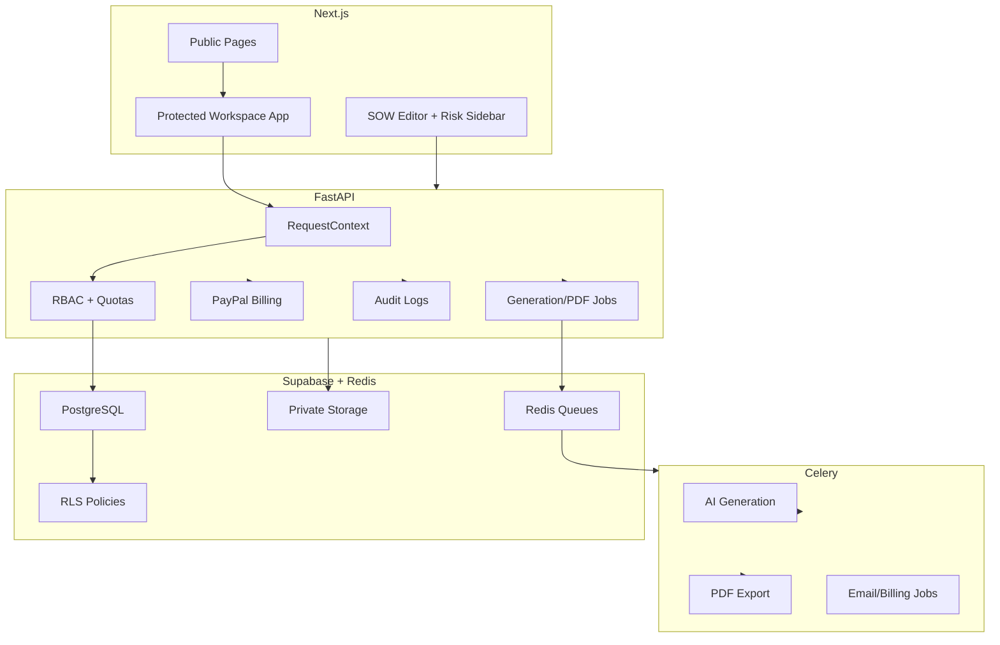

# BriefToScope Architecture

## Summary

BriefToScope is a multi-tenant SaaS for agency scope intelligence. PostgreSQL is the product authority for workspaces, roles, billing state, quotas, templates, SOWs, audit logs, and jobs. Clerk owns identity/session only. PayPal processes subscription approval and events, while BriefToScope owns in-app billing UX and feature gates.

## Layers

### Presentation

- Public: `/`, `/pricing`, `/sign-in`, `/sign-up`, `/privacy`, `/terms`, `/ai-disclosure`, `/data-retention`, `/refund-policy`, `/support`, public share/sign routes.
- Protected: `/onboarding`, `/dashboard`, `/generate`, `/sow/[id]`, `/templates`, `/settings`, `/settings/team`, `/settings/billing`, `/admin`.
- Next.js middleware protects app routes through Clerk.
- App pages use Clerk JWTs plus `X-Workspace-Id` for API calls.
- Client-side RBAC hides unavailable actions, but backend permission checks remain authoritative.

### Auth And Tenancy

- Clerk verifies session identity.
- `/api/auth/sync` mirrors Clerk users into `users`, ensures a default workspace, and returns the active workspace role.
- `RequestContext` resolves `user_id`, `org_id`, `role`, `plan`, and `subscription_status` for every protected FastAPI route.
- Roles: `owner`, `admin`, `member`, `reviewer`, `client_viewer`.

### Business Logic

FastAPI routers stay thin and call domain services:

- `auth`, `workspaces`, `projects`, `generations`, `sows`, `sow_sections`, `templates`, `billing`, `webhooks`, `admin`
- Services: AI orchestration, validation, clause intelligence, SOW persistence, PDF export, storage, PayPal billing, usage, audit logs, e-sign, worker jobs.
- Expensive actions run through quotas first: generation, PDF export, e-signature.
- Production generation and export are job-oriented; local/demo can use fallbacks only when explicitly enabled.

### AI

The pipeline remains A1-A7:

1. Transcript Cleaner
2. Brief Extractor
3. Scope Builder
4. Risk Detector
5. Clause Generator
6. SOW Composer
7. Quality Checker

Production rule: structured JSON is canonical. Markdown/PDF are render outputs. Deterministic validation checks timeline, payment, deliverables, revision policy, client responsibilities, acceptance criteria, and vague/risky language before the SOW is treated as export-ready.

The risk engine includes rule coverage for unlimited revisions, SEO ambiguity, copywriting ownership, missing assets, timeline dependency, third-party tools, animation complexity, payment milestones, acceptance criteria, and ownership/IP.

### Data And Security

- Supabase PostgreSQL stores tenant data.
- RLS policies provide defense in depth.
- Frontend does not write directly to Supabase tables.
- Supabase service role stays backend-only.
- PDF exports use private `sow-pdfs` storage paths and short-lived signed URLs.
- PayPal webhooks are signature-verified outside demo mode and stored idempotently.
- Audit logs record generation, edits, exports, signed URL requests, signatures, billing, and workspace actions.

## Deployment

- Vercel frontend
- Render FastAPI web service
- Render Celery worker service
- Upstash Redis broker
- Supabase DB/Storage
- PayPal Subscriptions
- Sentry/PostHog
- Optional Langfuse/Helicone tracing hooks

## System Diagram

## Current Boundaries

- No marketplace.
- No vector memory yet.
- No enterprise SSO yet.
- No multiplayer editor.
- No Kubernetes.
- PayPal remains the payment processor.
