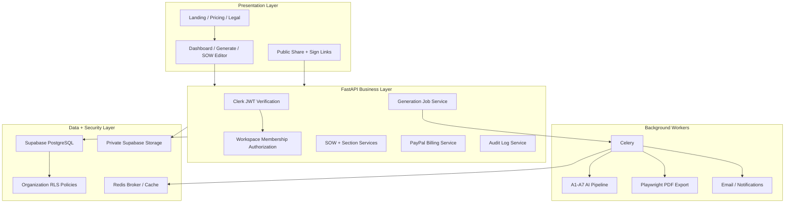

# BriefToScope Architecture

## Executive Summary

BriefToScope is a multi-tenant SaaS platform for AI-assisted scope intelligence. The system is organized around a protected agency workspace, a structured AI generation pipeline, editable SOW sections, risk intelligence, exports, e-signature handoff, and subscription gates.

The highest-trust production path is:

1. Store user/workspace permissions in PostgreSQL.
2. Generate structured SOW data before rendering Markdown/PDF.
3. Persist section-level SOW content and risk flags.
4. Run expensive AI/PDF/e-sign work through durable jobs.
5. Audit sensitive actions.
6. Keep client documents private and serve with signed links.

## System Diagram

## Frontend

- Framework: Next.js App Router, TypeScript, Tailwind CSS, shadcn/ui, Framer Motion.
- Public routes: `/`, `/pricing`, `/sign-in`, `/sign-up`, `/share/sow/[token]`, `/sign/[token]`.
- Protected routes: `/dashboard`, `/generate`, `/sow/[id]`, `/templates`, `/settings`, `/settings/team`, `/settings/billing`, `/admin`.
- Current auth UI is route-shell ready. Clerk UI integration still needs final wiring before production.

## Backend

FastAPI routers are split by product domain:

- `auth`: user/workspace sync
- `workspaces`: organizations, members, invites, brand settings
- `generations`: job creation, job status, SSE-style event stream
- `sows` and `sow_sections`: document CRUD, section edits, regeneration, risk audit
- `billing`: plans, PayPal checkout, usage summary
- `webhooks`: PayPal and DocuSign provider callbacks
- `templates`: industry templates and clause intelligence
- `admin`: operational readiness surface

Heavy work belongs in Celery workers. Local/demo mode can fall back to FastAPI background tasks.

## AI Pipeline

The current pipeline is:

1. A1 Transcript Cleaner
2. A2 Brief Extractor
3. A3 Scope Builder
4. A4 Risk Detector
5. A5 Clause Generator
6. A6 SOW Composer
7. A7 Quality Checker

Production rule: persist structured JSON first, then render Markdown/PDF. Do not let final Markdown be the only canonical data representation.

## Data Model

Core production tables:

- `users`
- `organizations`
- `organization_members`
- `projects`
- `transcripts`
- `sows`
- `sow_sections`
- `sow_versions`
- `sow_risk_flags`
- `templates`
- `clause_library`
- `brand_settings`
- `pdf_exports`
- `esign_requests`
- `billing_customers`
- `subscriptions`
- `usage_events`
- `audit_logs`
- `generation_jobs`
- `generation_job_events`
- `webhook_events`

Apply `database/production_foundation.sql`, then `database/production_rls_policies.sql`.

## Security Boundaries

- Frontend never writes directly to Supabase data tables in MVP.
- Backend verifies Clerk JWTs and checks PostgreSQL workspace membership.
- Supabase RLS acts as defense in depth.
- PayPal webhooks require signature verification outside demo mode.
- PDF exports should be private storage objects with signed URLs.
- Audit logs are required for generation, edit, export, share, signature send, billing, and membership actions.

## Deployment Topology

- Frontend: Vercel
- API: Render, Railway, Fly.io, or containerized cloud runtime
- Worker: separate Celery process with same backend image
- Redis: Upstash or managed Redis
- Database/storage: Supabase
- DNS/WAF: Cloudflare
- Monitoring: Sentry, PostHog, Langfuse/Helicone

## Known Architecture Gaps

- Clerk UI/session integration is not fully wired in frontend.
- PayPal subscription plan IDs and live webhook registration must be configured.
- Celery worker deployment exists in code but needs hosting process configuration.
- PDF storage should be switched fully to private buckets and signed URLs before paid users.
- Admin route needs strict allowlist enforcement before public deployment.
