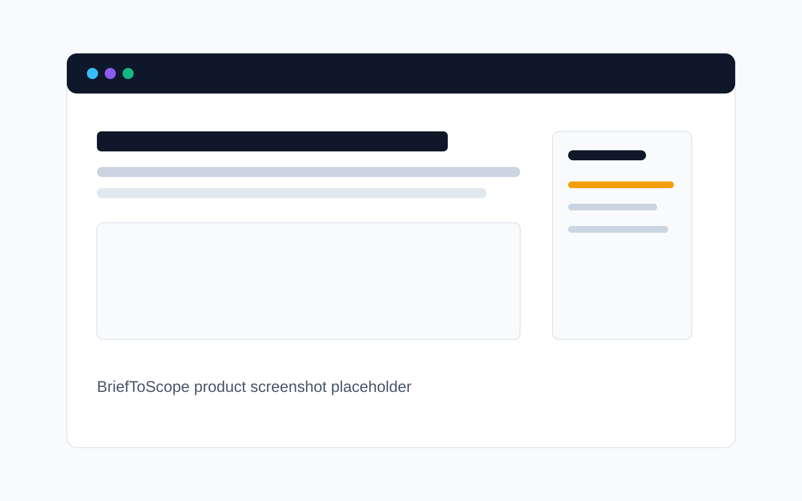
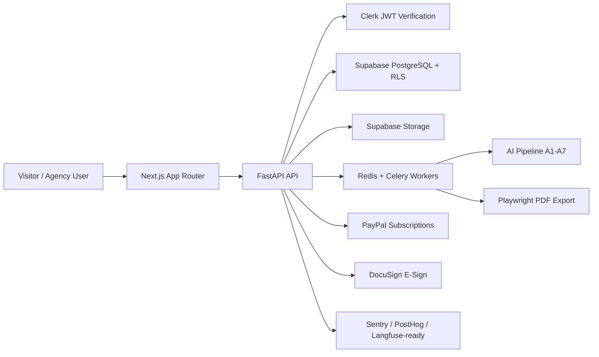

# BriefToScope

BriefToScope is an AI-native scope intelligence platform for agencies, studios, freelancers, and consultants. It turns messy discovery-call notes, client briefs, and transcripts into commercially safer Statements of Work with editable sections, scope-risk detection, PDF export, e-signature workflow, and workspace-ready SaaS foundations.

The product is intentionally positioned as **scope intelligence**, not a generic document generator. The core value is reducing ambiguity, preventing scope creep, and helping service businesses produce client-ready SOWs faster.

## Product Surface

- AI SOW generation from notes and transcripts
- Section-level SOW preview/editor
- AI risk flags and quality scoring
- PDF export pipeline
- E-signature workflow
- Workspace, membership, and role foundation
- PayPal subscription billing foundation
- Supabase PostgreSQL production schema and RLS policies
- Celery/Redis-ready background job architecture
- Demo mode for local product evaluation

## Screenshots

Launch screenshots should be added before public release:

- `docs/assets/landing-page.png`
- `docs/assets/generate-workspace.png`
- `docs/assets/sow-editor.png`
- `docs/assets/risk-sidebar.png`
- `docs/assets/billing-settings.png`

Until those are captured, the app can be reviewed locally with the setup below.



## Architecture



Full architecture: [ARCHITECTURE.md](ARCHITECTURE.md)

## Repository Layout

```text
backend/     FastAPI API, AI pipeline, services, workers, tests
frontend/    Next.js app, SaaS UI, editor, dashboard, public routes
database/    Supabase schema, production migrations, RLS policies
docs/        Product context and PRD artifacts
.github/     CI, issue templates, PR template, CODEOWNERS
```

## Local Development

### Requirements

- Node.js 20+
- Python 3.12+
- PostgreSQL client tools for production migration runs
- Optional: Redis for Celery worker testing
- Optional: Supabase project for production-mode storage/database

### Backend

```powershell
cd backend
python -m venv .venv
.\.venv\Scripts\Activate.ps1
pip install -r requirements.txt
$env:DEMO_MODE="true"
uvicorn app.main:app --reload --port 8000
```

### Frontend

```powershell
cd frontend
npm install
npm run dev
```

Open `http://localhost:3000`.

## Production Environment

Backend variables are documented in [backend/.env.example](backend/.env.example). Minimum production variables:

| Variable | Purpose |
| --- | --- |
| `DEMO_MODE=false` | Disables mocked auth/storage/provider behavior |
| `OPENAI_API_KEY` | AI generation provider |
| `SUPABASE_URL` | Supabase project URL |
| `SUPABASE_SERVICE_ROLE_KEY` | Backend-only Supabase service role key |
| `CLERK_JWKS_URL` | Clerk JWT verification keys |
| `CLERK_ISSUER` | Clerk issuer validation |
| `PAYPAL_CLIENT_ID` / `PAYPAL_CLIENT_SECRET` | PayPal subscription API |
| `PAYPAL_WEBHOOK_ID` | PayPal webhook signature verification |
| `REDIS_URL` | Celery broker/result backend |
| `FRONTEND_URL` / `BACKEND_URL` | CORS, links, provider callbacks |

Apply production database migrations in order:

```powershell
cd database
$env:DATABASE_URL="postgresql://..."
.\apply_production_migrations.ps1
```

## Useful Commands

```powershell
# Backend tests
cd backend
python -m pytest

# Frontend lint and production build
cd frontend
npm run lint
npm run build

# Optional worker
cd backend
celery -A app.workers.celery_app.celery_app worker -Q ai --loglevel=info
```

## API Documentation

- Local OpenAPI: `http://localhost:8000/docs`
- Maintained summary: [API_REFERENCE.md](API_REFERENCE.md)

## Launch Readiness

Read these before selling or deploying:

- [LAUNCH_CHECKLIST.md](LAUNCH_CHECKLIST.md)
- [SECURITY_AUDIT.md](SECURITY_AUDIT.md)
- [PERFORMANCE_REPORT.md](PERFORMANCE_REPORT.md)
- [TECH_DEBT.md](TECH_DEBT.md)
- [ROADMAP.md](ROADMAP.md)

## Billing Direction

BriefToScope currently uses **PayPal Subscriptions** for paid plan approval and webhook reconciliation. Stripe is intentionally not part of the active billing architecture unless the product direction changes.

## License

See [LICENSE](LICENSE).
