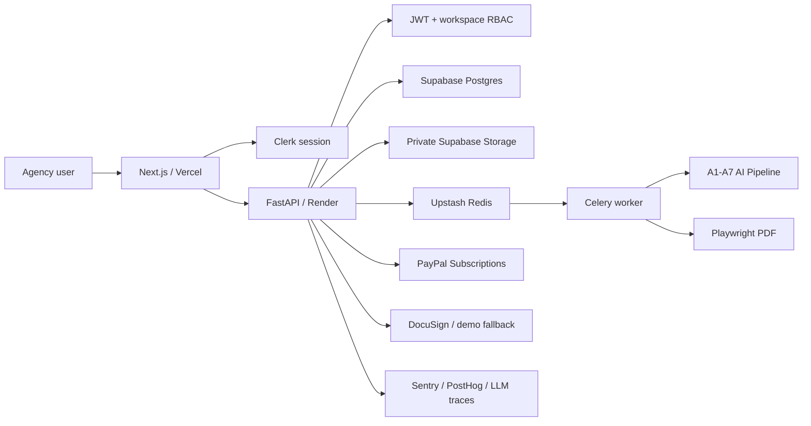

# BriefToScope

BriefToScope is an AI-native scope intelligence platform for agencies and consultants. It turns messy discovery notes, transcripts, and client briefs into commercially safer Statements of Work with structured sections, risk warnings, private PDF exports, e-sign handoff, workspace RBAC, PayPal subscriptions, quotas, and audit trails.

The product is not positioned as an "AI SOW generator." Its value is scope intelligence: reducing ambiguity, preventing scope creep, and helping agencies trust the documents they send to clients.

## Current Paid-Beta Surface

- Clerk-authenticated Next.js app with protected routes.
- PostgreSQL-backed workspaces, roles, billing state, quotas, and audit logs.
- FastAPI service layer with RBAC and quota checks before expensive actions.
- A1-A7 AI pipeline with structured JSON stored before Markdown/PDF rendering.
- Deterministic AI validation and expanded scope-risk rule engine.
- Section-level SOW editor with risk intelligence sidebar.
- Private Supabase PDF storage with short-lived signed URLs.
- PayPal subscription checkout, cancellation, reactivation, and idempotent webhooks.
- Celery/Redis worker scaffolding for AI generation and PDF export.
- Sentry/PostHog hooks and Langfuse/Helicone-compatible LLM trace hooks.
- Legal/support routes for privacy, terms, AI disclosure, data retention, refunds, and support.

## Architecture



Full system detail: [ARCHITECTURE.md](ARCHITECTURE.md)

## Repository Layout

```text
backend/     FastAPI API, AI pipeline, services, workers, tests
frontend/    Next.js app, SaaS UI, editor, dashboard, legal pages
database/    Supabase schema, production migrations, RLS policies
evals/       Sample transcripts and deterministic AI eval reports
docs/        Product context and PRD artifacts
.github/     CI, issue templates, PR template, CODEOWNERS
render.yaml  Render API + worker blueprint
```

## Local Development

Backend:

```powershell
cd backend
python -m venv .venv
.\.venv\Scripts\Activate.ps1
pip install -r requirements.txt
$env:DEMO_MODE="true"
uvicorn app.main:app --reload --port 8000
```

Frontend:

```powershell
cd frontend
npm install
npm run dev
```

Open `http://localhost:3000`.

## Production Deploy

- Frontend: Vercel using [frontend/vercel.json](frontend/vercel.json)
- API: Render web service using [render.yaml](render.yaml)
- Worker: Render worker service using the same backend image
- Redis: Upstash Redis
- Database/storage: Supabase
- Payments: PayPal Subscriptions

Apply production database SQL in this order:

```powershell
cd database
$env:DATABASE_URL="postgresql://..."
.\apply_production_migrations.ps1
```

## Required Validation

```powershell
cd backend
python -m pytest

cd ..\frontend
npm run lint
npm run build
npm audit --audit-level=high

cd ..
git diff --check
python evals/evaluate_outputs.py
```

## Key Environment Files

- [backend/.env.example](backend/.env.example)
- [frontend/.env.example](frontend/.env.example)
- [DEPLOYMENT.md](DEPLOYMENT.md)

Production must run with `DEMO_MODE=false`. Demo/provider fallbacks are allowed only for local/demo mode.

## Paid Beta Readiness

Read [PAID_BETA_READINESS.md](PAID_BETA_READINESS.md) before launch. It lists what is ready, what must be configured manually, and which items should remain post-launch rather than blocking the beta.

## Branch Policy

All work flows through `main`. Do not leave feature branches active after finishing work.

## License

See [LICENSE](LICENSE).
